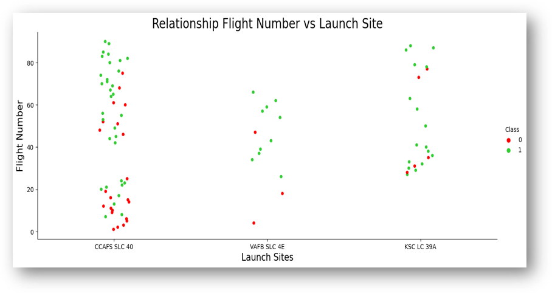
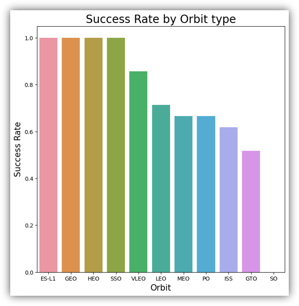
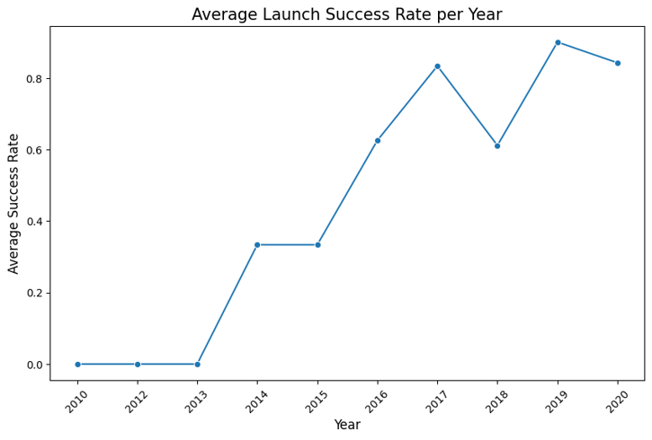
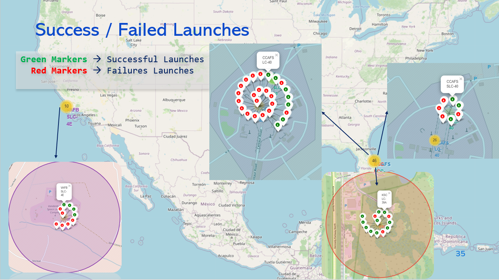
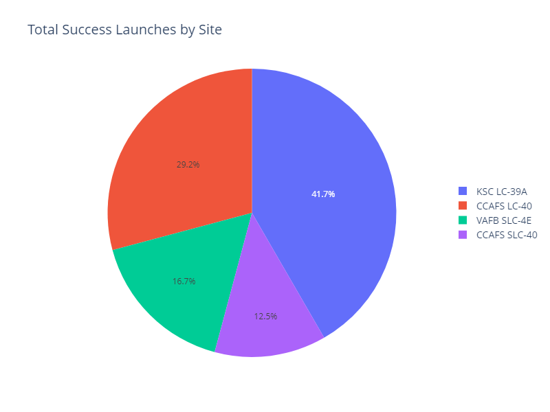
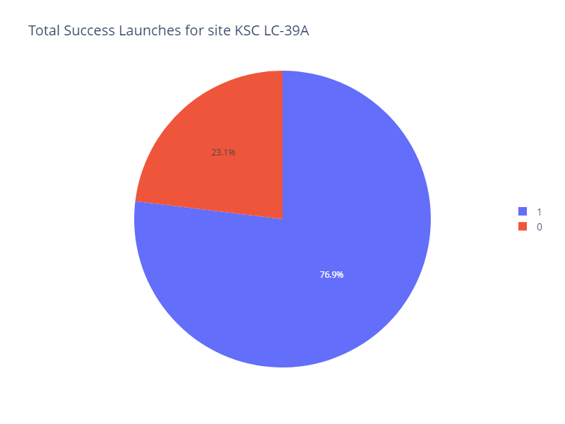
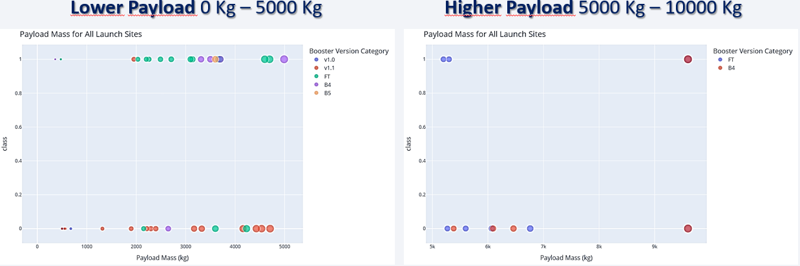
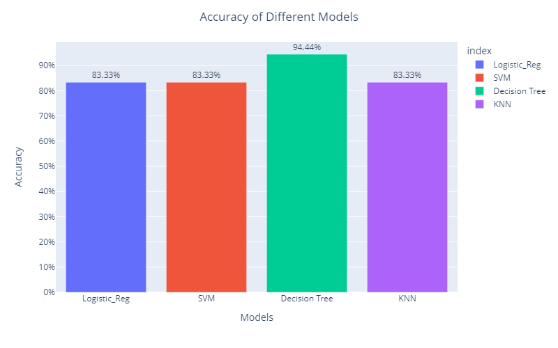
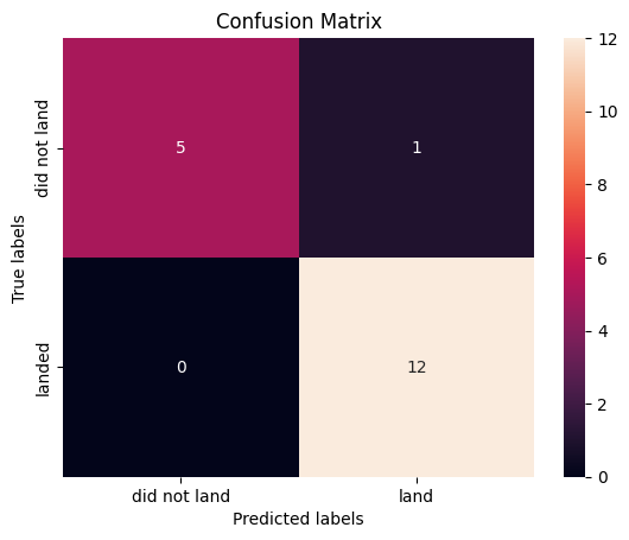

# SpaceX Falcon 9 Landing Prediction - IBM Data Science Capstone

This project is part of the IBM Data Science Capstone.

**Objective**: The goal is to predict whether the first stage of the Falcon 9 rocket will successfully land. Reusing the first stage can drastically reduce SpaceX’s launch costs.

We aim to answer:
- Can we accurately predict Falcon 9's first stage landing success?
- What are the key factors influencing the landing outcome (e.g., payload mass, orbit type)?
- How can this prediction help competitors match or exceed SpaceX's success?

## Data Sources
- SpaceX API
- Web Scraping

## Methodology
1. Data Wrangling:
   - Filtering and cleaning the data
   - Handling missing values
   - Applying One Hot Encoding for categorical values
2. Exploratory Data Analysis (EDA):
   - Data visualization with `matplotlib` and `seaborn`
   - SQL for data querying
   - Interactive visual analytics using `Folium` and `Plotly Dash`
3. Predictive Modeling:
   - Building, tuning, and evaluating classification models
   - Hyperparameter optimization

## Results
### Relationship Between Flight Number and Launch Site
The following chart shows the relationship between the number of launches (Flight Number) and the launch sites:

This suggests that as SpaceX launches more rockets, particularly from key locations, their ability to land the first stage improves.

### Success Rate by Orbit Type
This chart displays the success rate based on the orbit type of the mission:

Certain orbits, such as ES-L1, GEO, HEO, and SSO, show a perfect success rate.

### Yearly Trend in Success Rate
This graph shows the yearly trend in the success rate of SpaceX launches:

There is a consistent increase in the success rate of launches over time.

### Success and Failure of Launches
The following map illustrates the success and failure of launches from different sites:

Green markers indicate successful launches, while red markers represent failed launches. This visualization highlights trends in launch outcomes and the effectiveness of different launch sites over time.

### Total Launches by Year
The following chart shows the total number of launches per year:

KSC LC-39A recorded the highest number of successful launches whereas CCAFS SLC-40 had the lowest

### KSC LC-39A Success Rate
This chart illustrates the success rate of launches from the KSC LC-39A launch site:

The KSC LC-39A site shows the highest success rate, contributing to SpaceX's overall mission success.

### Low vs. High Payloads
The graph below compares the success rates for low and high payloads:

Payloads between 2k-4k kg tend to have higher success rates compared to heavier payloads.

### Model Accuracy Comparison
This bar chart compares the accuracy of different models used in the analysis:

The Decision Tree model outperforms other models with the highest accuracy rate.

### Confusion Matrix for Decision Tree Model
The confusion matrix below provides insight into the performance of the Decision Tree model:

  

The Decision Tree model demonstrated high accuracy, correctly classifying 17 out of 18 cases. However, the presence of false positives (Type I errors) suggests there is room for improvement, as they reduce the overall reliability of the model.

### Conclusion

- **Model Performance**: The Decision Tree Model is the top performer, achieving an impressive accuracy of 94.4%.
  
- **Proximity Launches**: All launch sites are strategically positioned near the coast to minimize risks to human populations and infrastructure in case of launch failures, emphasizing the importance of safety in mission planning.
  
- **KSC LC-39A**: This launch site boasts the highest success rate, making it the most reliable option for launches.
  
- **Orbits**: The orbits ES-L1, GEO, HEO, and SSO have demonstrated a perfect success rate, indicating high reliability.
  
- **Success Rates**: There is a noticeable trend of increasing success rates over time, attributed to continuous improvements in technology, mission planning, and operational efficiency, which reflect SpaceX's growing reliability with increased experience.

- **Booster Version**: The Falcon 9 FT booster version consistently performs well across various payload categories.

Future analyses could focus on the Falcon 9 FT booster version, which has shown high reliability across different payload ranges. This closer examination could enhance our understanding of its performance across varying mission profiles.

---

